# A2A uAgent Adapter

A comprehensive Python module for integrating A2A (Agent-to-Agent) systems with uAgents, enabling intelligent multi-agent coordination and communication.

## Overview

The A2A uAgent Adapter provides a seamless bridge between A2A agents and the uAgent ecosystem, allowing for:

- **Agent Coordination**: Manage multiple and single specialized a2a agents from a single interface
- **Intelligent Routing**: Automatically route queries to the most suitable agent based on keywords, specialties, or LLM-based analysis
- **Health Monitoring**: Continuous health checking and discovery of available agents
- **Fallback Mechanisms**: Robust error handling with fallback executors
- **Chat Protocol Integration**: Full support for uAgent chat protocols and messaging

## Features

### Agent Management

- Configure and manage multiple A2A agents with different specialties
- Automatic agent discovery and registration
- Health monitoring and status trackingKey 
- Registers Agent Cards for multiple A2A servers and runs them alongside the uAgent in a single terminal using different ports.
- Supports communication with both single and multiple A2A servers.
- Dynamically determines the appropriate A2A server based on the user query, sends the request via HTTP, and returns the response back to ASI:One.

### Intelligent Routing

- **Keyword Matching**: Route queries based on agent keywords and specialties
- **LLM-Based Routing**: Use AI to intelligently select the best agent for complex queries
- **Round-Robin**: Distribute load evenly across available agents
- **Priority-Based**: Assign priorities to agents for preferential routing

### Communication Protocols

- Full uAgent chat protocol support
- Asynchronous message handling
- Acknowledgment and error handling
- Real-time agent communication

### Reliability Features

- Health checking and agent discovery
- Fallback executor support
- Graceful error handling
- Timeout management

## Installation

```shell
pip install "uagents-adapter[a2a]"
pip install "a2a-sdk[all]"
```

## Quick Start


## Configuration

### A2AAgentConfig

Configure individual agents with specialized capabilities:

```python
config = A2AAgentConfig(
    name="SpecializedAgent",
    description="Agent description",
    url="http://localhost:9000",
    port=9000,
    specialties=["Machine Learning", "Data Science"],
    skills=["python", "tensorflow", "pandas"],  # Auto-generated if not provided
    examples=["Help with ML models", "Analyze data"],  # Auto-generated if not provided
    keywords=["ml", "ai", "data"],  # Auto-generated if not provided
    priority=1  # Higher numbers = higher priority
)
```

### Routing Strategies

#### Keyword Matching (Default)

Routes queries based on keyword and specialty matching with scoring:

```python
adapter = A2AAdapter(
    routing_strategy="keyword_match",
    # ... other config
)
```

#### LLM-Based Routing

Uses AI to intelligently select the best agent:

```python
adapter = A2AAdapter(
    routing_strategy="llm_routing",
    # ... other config
)
```

#### Round Robin

Distributes queries evenly across all healthy agents:

```python
adapter = A2AAdapter(
    routing_strategy="round_robin",
    # ... other config
)
```


### A2AAdapter

Main adapter class for managing A2A agents.

#### Constructor Parameters

| Parameter | Type | Default | Description |
|-----------|------|---------|-------------|
| `name` | str | Required | Name of the adapter |
| `description` | str | Required | Description of the adapter |
| `asi_api_key` | str | Required | ASI:One API Keys |
| `port` | int | 8000 | uAgent port |
| `mailbox` | bool | True | Enable mailbox functionality |
| `seed` | str | None | Seed for uAgent (auto-generated if None) |
| `agent_configs` | List[A2AAgentConfig] | [] | List of agent configurations |
| `fallback_executor` | AgentExecutor | None | Fallback executor for unrouted queries |
| `routing_strategy` | str | "keyword_match" | Routing strategy to use |

#### Methods

##### `add_agent_config(config: A2AAgentConfig)`

Add a new agent configuration to the adapter.

##### `run()`

Start the adapter and begin processing messages.

### A2AAgentConfig

Configuration class for individual A2A agents.

#### Constructor Parameters

| Parameter | Type | Default | Description |
|-----------|------|---------|-------------|
| `name` | str | Required | Agent name |
| `description` | str | Required | Agent description |
| `url` | str | Required | Agent URL |
| `port` | int | Required | Agent port |
| `specialties` | List[str] | Required | Agent specialties |
| `skills` | List[str] | Auto-generated | Agent skills |
| `examples` | List[str] | Auto-generated | Usage examples |
| `keywords` | List[str] | Auto-generated | Routing keywords |
| `priority` | int | 1 | Agent priority (higher = more preferred) |

## Architecture

```mermaid
flowchart LR
    UA[uAgent Chat<br>Protocol]
    AD[A2A Adapter]
    AG[A2A Agents]
    EUA[External<br>uAgents]
    HM[Health<br>Monitor]

    UA <--> AD
    AD <--> AG
    EUA <--> AD
    HM <--> AD

    subgraph Adapter_Router_Discovery [ ]
        direction TB
        RT[Router<br>• Keywords<br>• LLM<br>• Priority]
        DC[Discovery<br>& Health]
    end

    subgraph A2A_Agents [ ]
        direction TB
        Code[Code Agent]
        Data[Data Agent]
        Chat[Chat Agent]
    end

    AD --> RT
    AD --> DC

    AG --> Code
    AG --> Data
    AG --> Chat
```




## Message Flow

1. **Incoming Message**: External uAgent sends chat message
2. **Agent Discovery**: Adapter discovers and health-checks available agents
3. **Query Routing**: Router selects best agent based on strategy
4. **Message Forwarding**: Query sent to selected A2A agent
5. **Response Processing**: Agent response processed and formatted
6. **Reply**: Response sent back to original sender
7. **Acknowledgment**: Confirmation sent to complete the cycle

### Single Agent Setup

```python
from uagent_a2a_adapter import SingleA2AAdapter, A2AAgentConfig, a2a_servers
from brave.agent import BraveSearchAgentExecutor

def main():
    # Configure your agent
    agent_config = A2AAgentConfig(
        name="brave_search_specialist",
        description="AI Agent for web and news search using Brave Search API",
        url="http://localhost:10020",
        port=10020,
        specialties=["web search", "news", "information retrieval", "local business", "site-specific lookup"],
        priority=3
    )
    executor = BraveSearchAgentExecutor()
    # Start the A2A server
    a2a_servers([agent_config], {agent_config.name: executor})
    print(f"AgentCard manifest URL: http://localhost:{agent_config.port}/.well-known/agent.json")
    # Start the uAgent adapter
    adapter = SingleA2AAdapter(
        agent_executor=executor,
        name="brave",
        description="Routes queries to Brave Search AI specialists",
        port=8200,
        a2a_port=10030
    )
    adapter.run()

if __name__ == "__main__":
    main()
```

### Multi-Agent Setup

```python
from uagent_a2a_adapter import MultiA2AAdapter, A2AAgentConfig, a2a_servers
from agents.research_agent import ResearchAgentExecutor
from agents.coding_agent import CodingAgentExecutor
from agents.analysis_agent import AnalysisAgentExecutor

def main():
    agent_configs = [
        A2AAgentConfig(
            name="research_specialist",
            description="AI Research Specialist for research and analysis",
            url="http://localhost:10020",
            port=10020,
            specialties=["research", "analysis", "fact-finding", "summarization"],
            priority=3
        ),
        A2AAgentConfig(
            name="coding_specialist",
            description="AI Software Engineer for coding",
            url="http://localhost:10022",
            port=10022,
            specialties=["coding", "debugging", "programming"],
            priority=3
        ),
        A2AAgentConfig(
            name="analysis_specialist",
            description="AI Data Analyst for insights and metrics",
            url="http://localhost:10023",
            port=10023,
            specialties=["data analysis", "insights", "forecasting"],
            priority=2
        )
    ]
    executors = {
        "research_specialist": ResearchAgentExecutor(),
        "coding_specialist": CodingAgentExecutor(),
        "analysis_specialist": AnalysisAgentExecutor()
    }
    a2a_servers(agent_configs, executors)
    for config in agent_configs:
        print(f"AgentCard manifest URL: http://localhost:{config.port}/.well-known/agent.json")
    adapter = MultiA2AAdapter(
        name="coordinator---",
        description="Routes queries to AI specialists",
        asi_api_key="your_asi_api_key",
        port=8200,
        mailbox=True,
        agent_configs=agent_configs,
        routing_strategy="keyword_match"
    )
    adapter.run()

if __name__ == "__main__":
    main()
```

## Full Example: Single Agent (Brave Search)

Below is a complete example of a single-agent setup using Brave Search. This matches the latest code in function.py:

```python
from typing import Dict, List
from uagent_a2a_adapter import MultiA2AAdapter, A2AAgentConfig, a2a_servers
from brave.agent import BraveSearchAgentExecutor

class BraveSearchOrchestrator:
    def __init__(self):
        self.coordinator = None
        self.agent_configs: List[A2AAgentConfig] = []
        self.executors: Dict[str, any] = {}
        self.running = False

    def setup_agents(self):
        print("🔧 Setting up Brave Search Agent")
        self.agent_configs = [
            A2AAgentConfig(
                name="brave_search_specialist",
                description="AI Agent for web and news search using Brave Search API",
                url="http://localhost:10020",
                port=10020,
                specialties=["web search", "news", "information retrieval", "local business", "site-specific lookup"],
                priority=3
            )
        ]
        self.executors = {
            "brave_search_specialist": BraveSearchAgentExecutor()
        }
        print("✅ Brave Search Agent configuration created")

    def start_individual_a2a_servers(self):
        print("🔄 Starting Brave Search server...")
        a2a_servers(self.agent_configs, self.executors)
        print("✅ Brave Search server started!")
        print(f"AgentCard manifest URL: http://localhost:{self.agent_configs[0].port}/.well-known/agent.json")

    def create_coordinator(self):
        print("🤖 Creating Brave Coordinator...")
        self.coordinator = MultiA2AAdapter(
            name="brave_coordinator",
            description="Coordinator for routing Brave Search queries",
            asi_api_key="sk_5822be6c948d4a25830382b308f6f51ee13629ffe6fc4dc7a064cc26e486df84",
            port=8200,
            mailbox=True,
            agent_configs=self.agent_configs,
            routing_strategy="keyword_match"
        )
        print("✅ Brave Coordinator created!")
        return self.coordinator

    def start_system(self):
        print("🚀 Starting Brave Search System")
        try:
            self.setup_agents()
            self.start_individual_a2a_servers()
            coordinator = self.create_coordinator()
            self.running = True
            print(f"🎯 Starting Brave coordinator on port {coordinator.port}...")
            coordinator.run()
        except KeyboardInterrupt:
            print("👋 Shutting down Brave Search system...")
            self.running = False
        except Exception as e:
            print(f"❌ Error: {e}")
            self.running = False

def main():
    try:
        system = BraveSearchOrchestrator()
        system.start_system()
    except KeyboardInterrupt:
        print("👋 Brave system shutdown complete!")
    except Exception as e:
        print(f"❌ Error: {e}")

if __name__ == "__main__":
    main()
```

## Full Example: Multi-Agent Orchestrator

Below is a complete example of a multi-agent orchestrator, matching the latest code in multiagent.py:

```python
from typing import Dict, List
from uagent_a2a_adapter import MultiA2AAdapter, A2AAgentConfig, a2a_servers
from agents.research_agent import ResearchAgentExecutor
from agents.coding_agent import CodingAgentExecutor
from agents.analysis_agent import AnalysisAgentExecutor

class MultiAgentOrchestrator:
    def __init__(self):
        self.coordinator = None
        self.agent_configs: List[A2AAgentConfig] = []
        self.executors: Dict[str, any] = {}
        self.running = False

    def setup_agents(self):
        print("🔧 Setting up Multi-Agent System")
        self.agent_configs = [
            A2AAgentConfig(
                name="research_specialist",
                description="AI Research Specialist for research and analysis",
                url="http://localhost:10020",
                port=10020,
                specialties=["research", "analysis", "fact-finding", "summarization"],
                priority=3
            ),
            A2AAgentConfig(
                name="coding_specialist",
                description="AI Software Engineer for coding",
                url="http://localhost:10022",
                port=10022,
                specialties=["coding", "debugging", "programming"],
                priority=3
            ),
            A2AAgentConfig(
                name="analysis_specialist",
                description="AI Data Analyst for insights and metrics",
                url="http://localhost:10023",
                port=10023,
                specialties=["data analysis", "insights", "forecasting"],
                priority=2
            )
        ]
        self.executors = {
            "research_specialist": ResearchAgentExecutor(),
            "coding_specialist": CodingAgentExecutor(),
            "analysis_specialist": AnalysisAgentExecutor()
        }
        print("✅ Agent configurations created")

    def start_individual_a2a_servers(self):
        print("🔄 Starting servers...")
        a2a_servers(self.agent_configs, self.executors)
        print("✅ Servers started!")
        for config in self.agent_configs:
            print(f"AgentCard manifest URL: http://localhost:{config.port}/.well-known/agent.json")

    def create_coordinator(self):
        print("🤖 Creating Coordinator...")
        self.coordinator = MultiA2AAdapter(
            name="coordinator---",
            description="Routes queries to AI specialists",
            asi_api_key="sk_5822be6c948d4a25830382b308f6f51ee13629ffe6fc4dc7a064cc26e486df84",
            port=8200,
            mailbox=True,
            agent_configs=self.agent_configs,
            routing_strategy="keyword_match"
        )
        print("✅ Coordinator created!")
        return self.coordinator

    def start_system(self):
        print("🚀 Starting Multi-Agent System")
        try:
            self.setup_agents()
            self.start_individual_a2a_servers()
            coordinator = self.create_coordinator()
            self.running = True
            print(f"🎯 Starting coordinator on port {coordinator.port}...")
            coordinator.run()
        except KeyboardInterrupt:
            print("👋 Shutting down...")
            self.running = False
        except Exception as e:
            print(f"❌ Error: {e}")
            self.running = False

def main():
    try:
        system = MultiAgentOrchestrator()
        system.start_system()
    except KeyboardInterrupt:
        print("👋 Shutdown complete!")
    except Exception as e:
        print(f"❌ Error: {e}")

if __name__ == "__main__":
    main()
```

---

## Notes
- The recommended way to start A2A servers is with the `a2a_servers` utility, which handles server startup and manifest serving for each agent.
- After starting each A2A server, the manifest URL is printed for easy inspection and integration: `http://localhost:{port}/.well-known/agent.json`.
- Use `A2AAgentConfig` for all agent configuration, both single and multi-agent.
- The old `AgentConfig` dataclass and manual threading-based server startup are deprecated.

---


## Advanced Usage

### Custom Fallback Executor

```python
class CustomFallbackExecutor(AgentExecutor):
    async def execute(self, context, event_queue):
        # Custom fallback logic
        pass

adapter = A2AAdapter(
    name="SystemWithFallback",
    fallback_executor=CustomFallbackExecutor(),
    # ... other config
)
```

### Dynamic Agent Registration

```python
# Start with basic configuration
adapter = A2AAdapter(name="DynamicSystem")

# Add agents dynamically
new_agent = A2AAgentConfig(
    name="NewAgent",
    url="http://localhost:9003",
    port=9003,
    specialties=["Natural Language Processing"]
)
adapter.add_agent_config(new_agent)
```

### Health Monitoring

The adapter automatically monitors agent health and excludes unhealthy agents from routing:

- Health status is checked on startup and periodically
- Unhealthy agents are automatically excluded from routing
- Health checks include:
  - Agent card availability at /.well-known/agent.json
  - HTTP response status
  - Response time monitoring

## Error Handling

The adapter includes comprehensive error handling:

- **Agent Unavailable**: Automatically routes to alternative agents
- **Network Timeouts**: Configurable timeout settings with graceful degradation
- **Invalid Responses**: Fallback to error messages or alternative agents
- **Health Check Failures**: Automatic agent exclusion and retry logic
