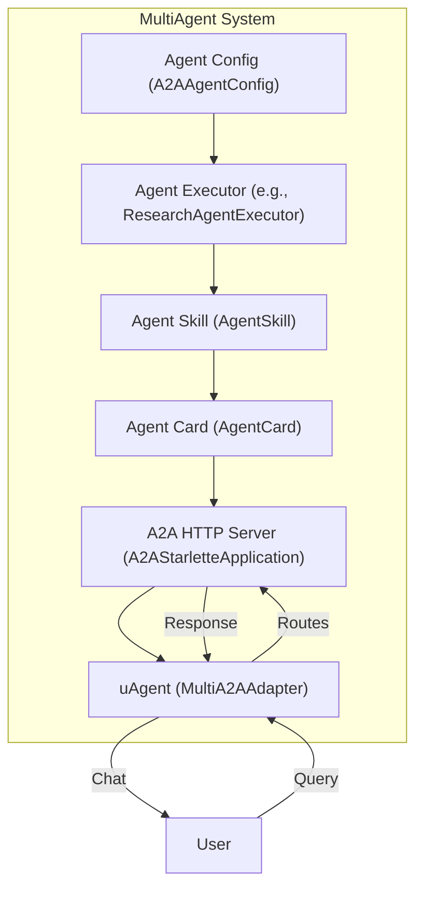
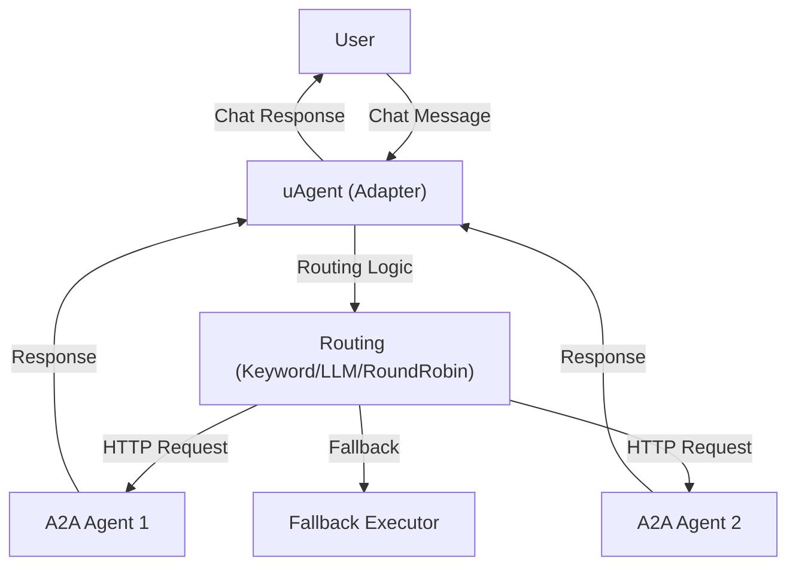
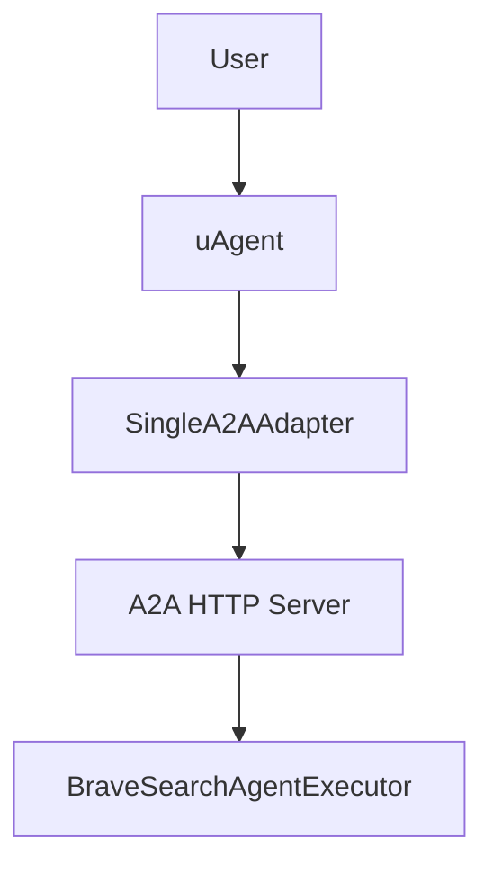

# A2A Adapter Documentation

## Overview

The **A2A Adapter** provides a bridge between uAgents (agentic framework) and the A2A (Agent-to-Agent) protocol, enabling seamless communication between agents using different protocols and architectures. It supports both single-agent and multi-agent routing, allowing for flexible integration and intelligent query handling.

This adapter is designed to:
- Expose uAgents as A2A-compatible HTTP endpoints.
- Route incoming queries to the most suitable agent based on keywords, specialties, or LLM-based selection.
- Support both single-agent and multi-agent scenarios.
- Provide fallback execution if no suitable agent is found.

---

## Features

- Configure and manage multiple A2A agents with different specialties
- Automatic agent discovery and registration
- Health monitoring and status tracking
- Registers Agent Cards for multiple A2A servers and runs them alongside the uAgent in a single terminal using different ports
- Supports communication with both single and multiple A2A servers
- Dynamically determines the appropriate A2A server based on the user query, sends the request via HTTP, and returns the response back to ASI:One
- **Keyword Matching**: Route queries based on agent keywords and specialties
- **LLM-Based Routing**: Use AI to intelligently select the best agent for complex queries
- **Round-Robin**: Distribute load evenly across available agents
- **Priority-Based**: Assign priorities to agents for preferential routing
- Full uAgent chat protocol support
- Asynchronous message handling
- Acknowledgment and error handling
- Real-time agent communication
- Health checking and agent discovery
- Fallback executor support
- Graceful error handling
- Timeout management

---

## Installation

```shell
pip install "uagents-adapter[a2a]"
```

---

## Example Usage

```python
from a2a_adapter import MultiA2AAdapter, A2AAgentConfig

agent_configs = [
    A2AAgentConfig(
        name="MathAgent",
        description="Solves math problems",
        url="http://localhost:9001",
        port=9001,
        specialties=["math", "arithmetic", "algebra"]
    ),
    A2AAgentConfig(
        name="WeatherAgent",
        description="Provides weather updates",
        url="http://localhost:9002",
        port=9002,
        specialties=["weather", "forecast", "climate"]
    )
]

adapter = MultiA2AAdapter(
    name="MultiAgentAdapter",
    description="Routes queries to the best agent",
    asi_api_key="YOUR_ASI_API_KEY",
    port=8000,
    agent_configs=agent_configs,
    routing_strategy="keyword_match"
)
adapter.run()
```

---

## AgentCard Creation Flow (adapter.py & multiagent.py)

### How AgentCard Content is Created and Used

1. **A2AAgentConfig**
   - This dataclass is where you define the agent's core metadata:
     - `name`: The agent's unique name (e.g., "research_specialist").
     - `description`: A human-readable summary of what the agent does (e.g., "AI Research Specialist for research and analysis").
     - `url` and `port`: Where the agent's HTTP server will be accessible.
     - `specialties`: List of topics or domains the agent is good at (e.g., `["research", "analysis"]`).
     - `skills`, `examples`, `keywords`, `priority`: Optional fields for routing and discovery. If not provided, they are auto-generated from specialties.
   - **How to write:**
     - Use clear, concise, and descriptive text for `name` and `description`.
     - List all relevant specialties for accurate routing.

2. **Agent Executor**
   - The executor (e.g., `ResearchAgentExecutor`) is the logic that processes queries. It receives the config and uses its fields to:
     - Set up prompts, system messages, or capabilities.
     - Inform the agent's behavior and response style.

3. **Agent Skill (AgentSkill)**
   - Created using the config's fields:
     - `id`, `name`, `description`, `tags` (from specialties), and `examples`.
   - **How to write:**
     - `id`: Usually a lowercase, underscored version of the name.
     - `tags`: Use specialties for discoverability.
     - `examples`: Short sample queries or tasks.

4. **Agent Card (AgentCard)**
   - Combines all the above into a manifest for the A2A server:
     - `name`, `description`, `url`, `version`, `defaultInputModes`, `defaultOutputModes`, `capabilities`, `skills` (list of AgentSkill).
   - This card is served at `/.well-known/agent.json` and is what platforms like AgentVerse use to discover and display your agent.
   - **How to write:**
     - Ensure all fields are filled and accurate.
     - `defaultInputModes`/`defaultOutputModes` should include "text" for chat.
     - `capabilities` can be left empty or set as needed.

5. **A2A HTTP Server (A2AStarletteApplication)**
   - Uses the AgentCard to expose the agent over HTTP.
   - The manifest is automatically generated from the AgentCard.

6. **uAgent (MultiA2AAdapter/SingleA2AAdapter)**
   - Handles chat protocol and routes queries to the correct A2A server based on the config and card.

### Example: Writing an Agent Config
```python
A2AAgentConfig(
    name="research_specialist",
    description="AI Research Specialist for research and analysis",
    url="http://localhost:10020",
    port=10020,
    specialties=["research", "analysis", "fact-finding", "summarization"]
)
```

### Diagram: AgentCard Creation and Flow



---

## How MultiA2AAdapter Works: Flow & Logic

The `MultiA2AAdapter` enables intelligent routing and management of multiple A2A agents. Here’s how it works, step by step:

1. **Initialization**
   - The adapter is initialized with a name, description, API key, port, agent configs, and routing strategy.
   - Example:
     ```python
     adapter = MultiA2AAdapter(
         name="coordinator",
         description="Routes queries to AI specialists",
         asi_api_key="...",
         port=8200,
         agent_configs=[...],
         routing_strategy="keyword_match"
     )
     ```

2. **Agent Configuration**
   - Each agent is described by an `A2AAgentConfig` (name, description, url, port, specialties, etc.).
   - These configs are used for discovery and routing.

3. **Startup & Discovery**
   - On startup, the adapter discovers and health-checks all configured agents by fetching their manifests (`/.well-known/agent.json`).
   - Healthy agents are tracked in `self.discovered_agents`.

4. **Message Handling**
   - The uAgent chat protocol is set up. When a message is received, the adapter:
     - Logs the incoming message.
     - Calls `_route_query` to select the best agent (using keyword, round-robin, or LLM-based routing).
     - If no agent matches, uses a fallback executor if available.

5. **Routing & Query Forwarding**
   - The selected agent’s endpoint is called via HTTP with the user’s query.
   - The adapter tries multiple endpoints (e.g., `/send-message`, `/message`, `/chat`).
   - If all fail, it can call the executor directly as a fallback.

6. **Response Handling**
   - The response from the A2A agent is wrapped as a `ChatMessage` and sent back to the original sender.
   - An acknowledgment is also sent for message delivery.

7. **Health Monitoring**
   - The adapter periodically checks agent health and updates its registry.

### Flow Summary

1. **User sends a message** →
2. **uAgent receives and logs** →
3. **Adapter discovers/refreshes agents** →
4. **Routes query to best agent** →
5. **Sends HTTP request to agent** →
6. **Receives and wraps response** →
7. **Sends response and acknowledgment to user**

**Key Methods Referenced:**
- `__init__`, `add_agent_config`, `_setup_protocols`, `_discover_and_health_check_agents`, `_route_query`, `_route_by_keywords`, `_llm_route_query`, `_send_to_a2a_agent`, `_call_fallback_executor`, `run`

This flow enables robust, scalable, and intelligent multi-agent orchestration for A2A and chat-based systems.

---

## Architecture Diagram

Below is a high-level diagram of the A2A Adapter architecture:



---

## File Structure
- `SingleA2AAdapter`: For exposing a single agent as A2A.
- `MultiA2AAdapter`: For managing and routing between multiple agents.
- `A2AAgentConfig`: Agent configuration and metadata.

---

## Extending & Customizing
- **Add new agents** by appending to `agent_configs`.
- **Change routing** by setting `routing_strategy` to `keyword_match`, `round_robin`, or `llm`.
- **Customize health checks** or fallback logic as needed.

---

## References
- [A2A Protocol Documentation](https://github.com/agent-protocol/a2a)
- [uAgents Framework](https://github.com/uAgents/uAgents)
- [ASI1 API](https://asi1.ai/)

---

## Maintainers
For questions or contributions, please contact the maintainers of this repository.

---

# SingleA2AAdapter Example

This example demonstrates how to use the `SingleA2AAdapter` from the `uagent_a2a_adapter` package to wrap a Brave Search agent and expose it via both uAgent and A2A HTTP interfaces.

## Overview
- Sets up a Brave Search agent as an A2A-compatible service
- Starts both the A2A HTTP server and the uAgent
- Shows how to configure, start, and coordinate the agent system



## Usage

```python
from uagent_a2a_adapter import SingleA2AAdapter
from brave.agent import BraveSearchAgentExecutor

adapter = SingleA2AAdapter(
    agent_executor=BraveSearchAgentExecutor(),
    name="brave",
    description="Routes queries to Brave Search AI specialists",
    port=8200,
    a2a_port=10030
)
adapter.run()
```

---

## Full System Example: SingleAgent Coordinator

This example shows how to set up a full system with a single Brave Search agent, including both the A2A HTTP server and the uAgent coordinator.

```python
import asyncio
import threading
import time
from typing import Dict, List
from dataclasses import dataclass

from uagent_a2a_adapter import SingleA2AAdapter
from brave.agent import BraveSearchAgentExecutor

@dataclass
class AgentConfig:
    name: str
    description: str
    port: int
    a2a_port: int
    specialties: List[str]
    executor_class: str

class SingleAgent:
    def __init__(self):
        self.coordinator: SingleA2AAdapter = None
        self.agent_configs: List[AgentConfig] = []
        self.executors: Dict[str, any] = {}
        self.running = False

    def setup_agents(self):
        print("🔧 Setting up A2A SingleAgent System\n" + "=" * 60)
        self.agent_configs = [
            AgentConfig(
                name="brave_search",
                description="AI Search Agent powered by Brave Search API",
                port=8100,
                a2a_port=10020,
                specialties=["web search", "local search", "information retrieval", "news search", "business lookup"],
                executor_class="BraveSearchAgentExecutor"
            ),
        ]
        self.executors = {"BraveSearchAgentExecutor": BraveSearchAgentExecutor()}
        for config in self.agent_configs:
            print(f"✅ {config.name}: {', '.join(config.specialties)}")

    def start_individual_a2a_servers(self):
        from a2a.server.apps import A2AStarletteApplication
        from a2a.server.request_handlers import DefaultRequestHandler
        from a2a.server.tasks import InMemoryTaskStore
        from a2a.types import AgentCapabilities, AgentCard, AgentSkill
        import uvicorn

        def start_server(config: AgentConfig, executor):
            try:
                skill = AgentSkill(
                    id=f"{config.name.lower()}_skill",
                    name=config.name.replace("_", " ").title(),
                    description=config.description,
                    tags=config.specialties,
                    examples=[f"Search for {s.lower()}" for s in config.specialties[:3]],
                )
                agent_card = AgentCard(
                    name=config.name.replace("_", " ").title(),
                    description=config.description,
                    url=f"http://localhost:{config.a2a_port}/",
                    version="1.0.0",
                    defaultInputModes=["text"],
                    defaultOutputModes=["text"],
                    capabilities=AgentCapabilities(),
                    skills=[skill],
                )
                server = A2AStarletteApplication(
                    agent_card=agent_card,
                    http_handler=DefaultRequestHandler(
                        agent_executor=executor,
                        task_store=InMemoryTaskStore()
                    )
                )
                print(f"🚀 Starting {config.name} on port {config.a2a_port}")
                uvicorn.run(server.build(), host="0.0.0.0", port=config.a2a_port, timeout_keep_alive=10, log_level="info")
            except Exception as e:
                print(f"❌ Error starting {config.name}: {e}")

        print("\n🔄 Starting A2A servers...")
        for config in self.agent_configs:
            executor = self.executors[config.executor_class]
            threading.Thread(target=start_server, args=(config, executor), daemon=True).start()
            time.sleep(1)
        print("⏳ Initializing servers..."), time.sleep(5), print("✅ All A2A servers started!")

    def create_coordinator(self):
        print("\n🤖 Creating Coordinator...")
        self.coordinator = SingleA2AAdapter(
            agent_executor=self.executors["BraveSearchAgentExecutor"],
            name="brave",
            description="Routes queries to Brave Search AI specialists",
            port=8200,
            a2a_port=10030  
        )
        print(f"✅ Coordinator on port {self.coordinator.port}")
        return self.coordinator

    def start_system(self):
        print("🚀 Starting A2A System\n" + "=" * 70)
        try:
            self.setup_agents()
            self.start_individual_a2a_servers()
            coordinator = self.create_coordinator()
            print(f"\n🎯 Running coordinator on port {coordinator.port}...\nPress Ctrl+C to stop\n")
            self.running = True
            coordinator.run()
        except KeyboardInterrupt:
            print("\n👋 System shutdown...")
            self.running = False
        except Exception as e:
            print(f"❌ Error: {e}")
            self.running = False


def create_brave_search_agent_system():
    return SingleAgent()


def main():
    try:
        system = create_brave_search_agent_system()
        system.start_system()
    except KeyboardInterrupt:
        print("\n👋 Shutdown complete!")
    except Exception as e:
        print(f"\n❌ Error: {e}")


if __name__ == "__main__":
    main()
```

---

