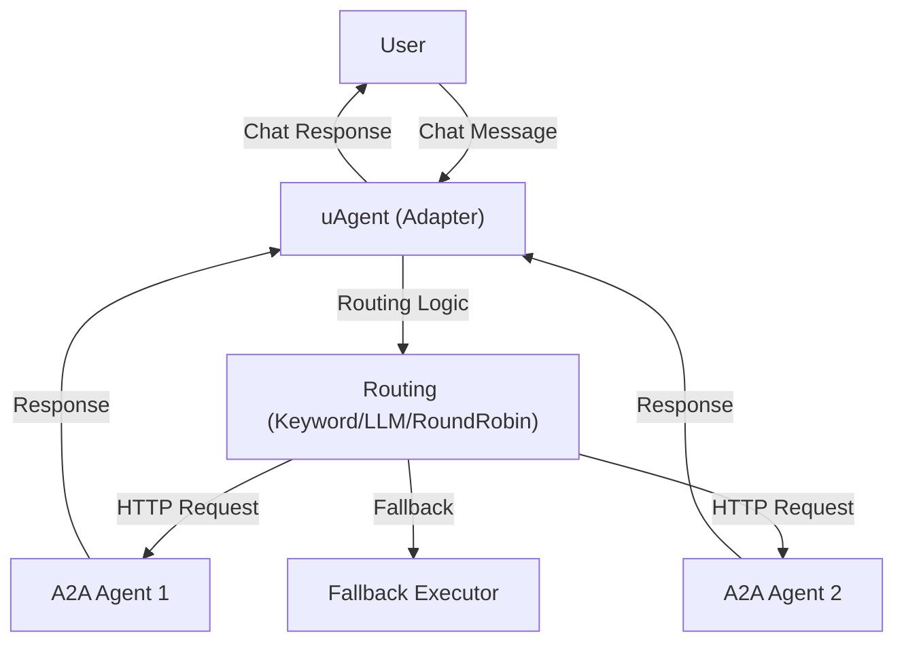
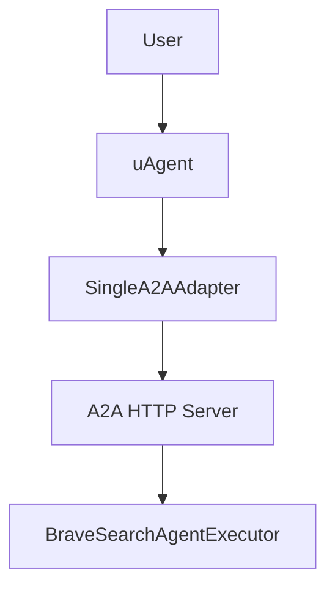

# A2A Adapter Documentation

## Overview

The **A2A Adapter** provides a bridge between uAgents (agentic framework) and the A2A (Agent-to-Agent) protocol, enabling seamless communication between agents using different protocols and architectures. It supports both single-agent and multi-agent routing, allowing for flexible integration and intelligent query handling.

This adapter is designed to:
- Expose uAgents as A2A-compatible HTTP endpoints.
- Route incoming queries to the most suitable agent based on keywords, specialties, or LLM-based selection.
- Support both single-agent and multi-agent scenarios.
- Provide fallback execution if no suitable agent is found.

---

## Components

### 1. `A2AAgentConfig`
A dataclass for configuring each agent, including name, description, URL, specialties, skills, and routing metadata.

### 2. `SingleA2AAdapter`
- Wraps a single uAgent and exposes it as an A2A HTTP server.
- Handles incoming chat messages, forwards them to the agent, and returns responses.
- Supports direct execution fallback if HTTP endpoints are unavailable.

### 3. `MultiA2AAdapter`
- Manages multiple agent configurations.
- Discovers and health-checks available agents at runtime.
- Routes queries to the best agent using keyword matching, round-robin, or LLM-based strategies.
- Provides fallback execution if no agent matches.

---

## How It Works

### Message Flow
1. **User sends a message** to the uAgent (via chat protocol).
2. **Adapter receives the message** and determines the best agent to handle it (using routing strategies).
3. **Adapter forwards the message** to the selected A2A agent's HTTP endpoint.
4. **A2A agent processes the message** and returns a response.
5. **Adapter relays the response** back to the original sender.
6. **Acknowledgement** is sent for message delivery.

### Routing Strategies
- **Keyword Match:** Scores agents based on keyword, specialty, and skill overlap with the query.
- **Round Robin:** Rotates through available agents.
- **LLM Routing:** Uses a language model to select the best agent based on query and agent descriptions.

### Fallback
If no agent matches, or if all endpoints fail, the adapter can call a fallback executor directly (if provided).

---

## Example Usage

```python
# Example: Setting up a MultiA2AAdapter
from a2a_adapter import MultiA2AAdapter, A2AAgentConfig

agent_configs = [
    A2AAgentConfig(
        name="MathAgent",
        description="Solves math problems",
        url="http://localhost:9001",
        port=9001,
        specialties=["math", "arithmetic", "algebra"]
    ),
    A2AAgentConfig(
        name="WeatherAgent",
        description="Provides weather updates",
        url="http://localhost:9002",
        port=9002,
        specialties=["weather", "forecast", "climate"]
    )
]

adapter = MultiA2AAdapter(
    name="MultiAgentAdapter",
    description="Routes queries to the best agent",
    asi_api_key="YOUR_ASI_API_KEY",
    port=8000,
    agent_configs=agent_configs,
    routing_strategy="keyword_match"
)
adapter.run()
```

---

## Architecture Diagram

Below is a high-level diagram of the A2A Adapter architecture:



---

## File Structure
- `SingleA2AAdapter`: For exposing a single agent as A2A.
- `MultiA2AAdapter`: For managing and routing between multiple agents.
- `A2AAgentConfig`: Agent configuration and metadata.

---

## Extending & Customizing
- **Add new agents** by appending to `agent_configs`.
- **Change routing** by setting `routing_strategy` to `keyword_match`, `round_robin`, or `llm`.
- **Customize health checks** or fallback logic as needed.

---

## References
- [A2A Protocol Documentation](https://github.com/agent-protocol/a2a)
- [uAgents Framework](https://github.com/uAgents/uAgents)
- [ASI1 API](https://asi1.ai/)

---

## Maintainers
For questions or contributions, please contact the maintainers of this repository.

---

# SingleA2AAdapter Example

This example demonstrates how to use the `SingleA2AAdapter` from the `uagent_a2a_adapter` package to wrap a Brave Search agent and expose it via both uAgent and A2A HTTP interfaces.

## Overview
- Sets up a Brave Search agent as an A2A-compatible service
- Starts both the A2A HTTP server and the uAgent
- Shows how to configure, start, and coordinate the agent system



## Usage

```python
from uagent_a2a_adapter import SingleA2AAdapter
from brave.agent import BraveSearchAgentExecutor

adapter = SingleA2AAdapter(
    agent_executor=BraveSearchAgentExecutor(),
    name="brave",
    description="Routes queries to Brave Search AI specialists",
    port=8200,
    a2a_port=10030
)
adapter.run()
```

---

## Full System Example: SingleAgent Coordinator

This example shows how to set up a full system with a single Brave Search agent, including both the A2A HTTP server and the uAgent coordinator.

```python
import asyncio
import threading
import time
from typing import Dict, List
from dataclasses import dataclass

from uagent_a2a_adapter import SingleA2AAdapter
from brave.agent import BraveSearchAgentExecutor

@dataclass
class AgentConfig:
    name: str
    description: str
    port: int
    a2a_port: int
    specialties: List[str]
    executor_class: str

class SingleAgent:
    def __init__(self):
        self.coordinator: SingleA2AAdapter = None
        self.agent_configs: List[AgentConfig] = []
        self.executors: Dict[str, any] = {}
        self.running = False

    def setup_agents(self):
        print("🔧 Setting up A2A SingleAgent System\n" + "=" * 60)
        self.agent_configs = [
            AgentConfig(
                name="brave_search",
                description="AI Search Agent powered by Brave Search API",
                port=8100,
                a2a_port=10020,
                specialties=["web search", "local search", "information retrieval", "news search", "business lookup"],
                executor_class="BraveSearchAgentExecutor"
            ),
        ]
        self.executors = {"BraveSearchAgentExecutor": BraveSearchAgentExecutor()}
        for config in self.agent_configs:
            print(f"✅ {config.name}: {', '.join(config.specialties)}")

    def start_individual_a2a_servers(self):
        from a2a.server.apps import A2AStarletteApplication
        from a2a.server.request_handlers import DefaultRequestHandler
        from a2a.server.tasks import InMemoryTaskStore
        from a2a.types import AgentCapabilities, AgentCard, AgentSkill
        import uvicorn

        def start_server(config: AgentConfig, executor):
            try:
                skill = AgentSkill(
                    id=f"{config.name.lower()}_skill",
                    name=config.name.replace("_", " ").title(),
                    description=config.description,
                    tags=config.specialties,
                    examples=[f"Search for {s.lower()}" for s in config.specialties[:3]],
                )
                agent_card = AgentCard(
                    name=config.name.replace("_", " ").title(),
                    description=config.description,
                    url=f"http://localhost:{config.a2a_port}/",
                    version="1.0.0",
                    defaultInputModes=["text"],
                    defaultOutputModes=["text"],
                    capabilities=AgentCapabilities(),
                    skills=[skill],
                )
                server = A2AStarletteApplication(
                    agent_card=agent_card,
                    http_handler=DefaultRequestHandler(
                        agent_executor=executor,
                        task_store=InMemoryTaskStore()
                    )
                )
                print(f"🚀 Starting {config.name} on port {config.a2a_port}")
                uvicorn.run(server.build(), host="0.0.0.0", port=config.a2a_port, timeout_keep_alive=10, log_level="info")
            except Exception as e:
                print(f"❌ Error starting {config.name}: {e}")

        print("\n🔄 Starting A2A servers...")
        for config in self.agent_configs:
            executor = self.executors[config.executor_class]
            threading.Thread(target=start_server, args=(config, executor), daemon=True).start()
            time.sleep(1)
        print("⏳ Initializing servers..."), time.sleep(5), print("✅ All A2A servers started!")

    def create_coordinator(self):
        print("\n🤖 Creating Coordinator...")
        self.coordinator = SingleA2AAdapter(
            agent_executor=self.executors["BraveSearchAgentExecutor"],
            name="brave",
            description="Routes queries to Brave Search AI specialists",
            port=8200,
            a2a_port=10030  
        )
        print(f"✅ Coordinator on port {self.coordinator.port}")
        return self.coordinator

    def start_system(self):
        print("🚀 Starting A2A System\n" + "=" * 70)
        try:
            self.setup_agents()
            self.start_individual_a2a_servers()
            coordinator = self.create_coordinator()
            print(f"\n🎯 Running coordinator on port {coordinator.port}...\nPress Ctrl+C to stop\n")
            self.running = True
            coordinator.run()
        except KeyboardInterrupt:
            print("\n👋 System shutdown...")
            self.running = False
        except Exception as e:
            print(f"❌ Error: {e}")
            self.running = False


def create_brave_search_agent_system():
    return SingleAgent()


def main():
    try:
        system = create_brave_search_agent_system()
        system.start_system()
    except KeyboardInterrupt:
        print("\n👋 Shutdown complete!")
    except Exception as e:
        print(f"\n❌ Error: {e}")


if __name__ == "__main__":
    main()
```

---
