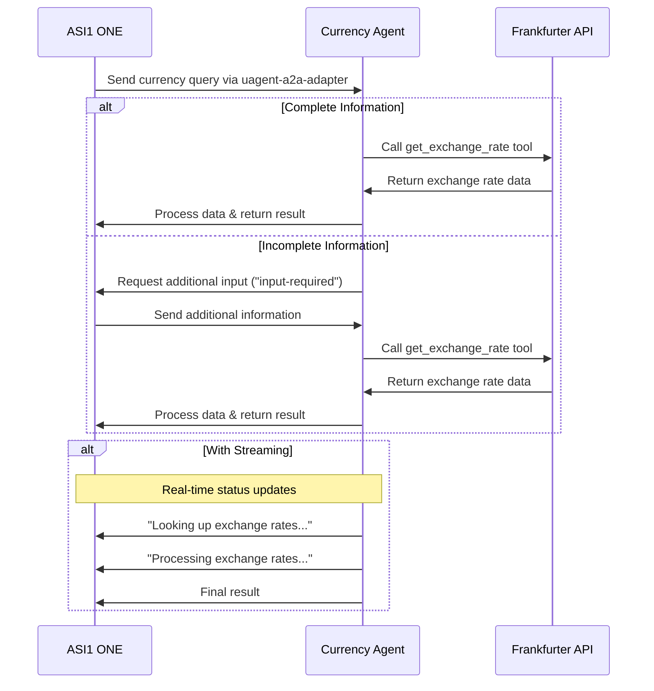
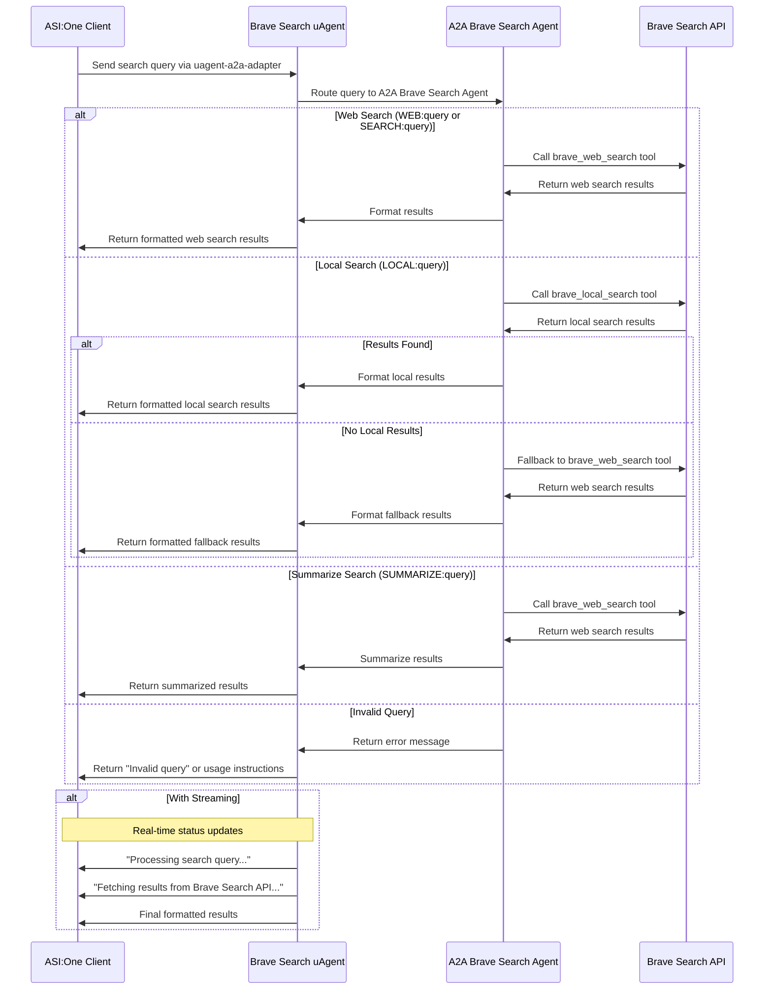

Below is the updated README file for the LangGraph Currency Agent, reflecting the provided code changes, the integration with the `uagent-a2a-adapter`, and the removal of the client agent (now assuming the user sends queries directly via an A2A client). The README has been streamlined to align with the new architecture, focusing on the `SingleAgent` system, the A2A protocol, and the user interaction model via an A2A client.

---

# LangGraph Currency Agent with A2A Protocol

This sample demonstrates a currency conversion agent built with [LangGraph](https://langchain-ai.github.io/langgraph/) and exposed through the A2A protocol using the `uagent-a2a-adapter`. It supports conversational interactions with multi-turn dialogue and streaming responses, where users send queries via an A2A client.

## How It Works

The agent uses LangGraph with an LLM (e.g., Google Gemini or OpenAI-compatible models) to provide currency exchange information through a ReAct agent pattern. The A2A protocol enables standardized interaction, allowing clients to send queries to a coordinator that routes them to the currency agent.



## Key Features

- **Multi-turn Conversations**: Requests additional information when needed.
- **Real-time Streaming**: Provides status updates during processing.
- **Push Notifications**: Supports webhook-based notifications.
- **Conversational Memory**: Maintains context across interactions using LangGraph's checkpoint memory.
- **Currency Exchange Tool**: Integrates with the Frankfurter API for real-time rates.
- **A2A Coordinator**: Routes queries to the currency agent using a keyword-matching strategy.

## Prerequisites

- Python 3.12 or higher
- [UV](https://docs.astral.sh/uv/)
- Access to an LLM and API Key (Google Gemini or OpenAI-compatible)
- Environment variables configured for the chosen LLM

## Setup & Running

1. Navigate to the project directory:

   ```bash
   cd samples/python/agents/langgraph
   ```

2. Create an environment file with your API key:

   ```bash
   # For Google Gemini model
   echo "model_source=google" > .env
   echo "GOOGLE_API_KEY=your_api_key_here" >> .env

   # For OpenAI or compatible API (e.g., local LLM via Ollama, LM Studio)
   echo "model_source=openai" > .env
   echo "API_KEY=your_api_key_here" >> .env  # Optional if not required
   echo "TOOL_LLM_URL=your_llm_url" >> .env
   echo "TOOL_LLM_NAME=your_llm_name" >> .env
   ```

3. Install dependencies and run the agent system:

   ```bash
   # Install dependencies
   uv sync

   # Run the agent system (coordinator on port 8200, agent on port 10000)
   uv run app
   ```

4. Send queries using an A2A client (e.g., via `curl`, Postman, or a custom A2A client):

   ```bash
   curl -X POST http://0.0.0.0:8200 \
   -H "Content-Type: application/json" \
   -d '{
       "id": "12113c25-b752-473f-977e-c9ad33cf4f56",
       "jsonrpc": "2.0",
       "method": "message/send",
       "params": {
           "message": {
               "kind": "message",
               "messageId": "120ec73f93024993becf954d03a672bc",
               "parts": [
                   {
                       "kind": "text",
                       "text": "how much is 10 USD in INR?"
                   }
               ],
               "role": "user"
           }
       }
   }'
   ```

## Build Container Image

The agent can be deployed as a container for portability.

1. Navigate to the project directory:

   ```bash
   cd samples/python/agents/langgraph
   ```

2. Build the container image:

   ```bash
   podman build . -t langgraph-a2a-server
   ```

   > [!Tip]  
   > Podman is a drop-in replacement for `docker`, which can also be used.

3. Run the container:

   ```bash
   podman run -p 8200:8200 -p 10000:10000 \
   -e GOOGLE_API_KEY=your_api_key_here \
   langgraph-a2a-server
   ```

4. Send queries to the coordinator at `http://0.0.0.0:8200` using an A2A client.

> [!Important]
> - **Access URL**: Use `0.0.0.0:8200` for the coordinator. `localhost` may not work due to container networking.
> - **Hostname Override**: If deploying in an environment with a different hostname, set the `HOST_OVERRIDE` environment variable to ensure proper AgentCard configuration.

## Technical Implementation

- **LangGraph ReAct Agent**: Uses the ReAct pattern for reasoning and tool invocation.
- **A2A Coordinator**: Routes queries to the currency agent using keyword matching.
- **Streaming Support**: Delivers incremental updates via the A2A protocol.
- **Checkpoint Memory**: Persists conversation state between turns using LangGraph's `MemorySaver`.
- **Push Notifications**: Supports webhook-based updates with JWK authentication.
- **A2A Protocol**: Fully compliant with A2A specifications for agent-to-agent communication.
- **Frankfurter API**: Provides real-time currency exchange rates.

## Limitations

- Supports only text-based input/output (no multi-modal capabilities).
- Relies on the Frankfurter API, which has limited currency options.
- Session-based memory is not persisted between server restarts.
- Cancellation of tasks is not supported (`UnsupportedOperationError`).

## Examples

### Synchronous Request

**Request** (to `http://0.0.0.0:8200`):

```json
{
    "id": "12113c25-b752-473f-977e-c9ad33cf4f56",
    "jsonrpc": "2.0",
    "method": "message/send",
    "params": {
        "message": {
            "kind": "message",
            "messageId": "120ec73f93024993becf954d03a672bc",
            "parts": [
                {
                    "kind": "text",
                    "text": "how much is 10 USD in INR?"
                }
            ],
            "role": "user"
        }
    }
}
```

**Response**:

```json
{
    "id": "12113c25-b752-473f-977e-c9ad33cf4f56",
    "jsonrpc": "2.0",
    "result": {
        "artifacts": [
            {
                "artifactId": "08373241-a745-4abe-a78b-9ca60882bcc6",
                "name": "conversion_result",
                "parts": [
                    {
                        "kind": "text",
                        "text": "10 USD is 856.2 INR."
                    }
                ]
            }
        ],
        "contextId": "e329f200-eaf4-4ae9-a8ef-a33cf9485367",
        "history": [
            {
                "contextId": "e329f200-eaf4-4ae9-a8ef-a33cf9485367",
                "kind": "message",
                "messageId": "120ec73f93024993becf954d03a672bc",
                "parts": [
                    {
                        "kind": "text",
                        "text": "how much is 10 USD in INR?"
                    }
                ],
                "role": "user",
                "taskId": "58124b63-dd3b-46b8-bf1d-1cc1aefd1c8f"
            },
            {
                "contextId": "e329f200-eaf4-4ae9-a8ef-a33cf9485367",
                "kind": "message",
                "messageId": "d8b4d7de-709f-40f7-ae0c-fd6ee398a2bf",
                "parts": [
                    {
                        "kind": "text",
                        "text": "Looking up the exchange rates..."
                    }
                ],
                "role": "agent",
                "taskId": "58124b63-dd3b-46b8-bf1d-1cc1aefd1c8f"
            },
            {
                "contextId": "e329f200-eaf4-4ae9-a8ef-a33cf9485367",
                "kind": "message",
                "messageId": "ee0cb3b6-c3d6-4316-8d58-315c437a2a77",
                "parts": [
                    {
                        "kind": "text",
                        "text": "Processing the exchange rates..."
                    }
                ],
                "role": "agent",
                "taskId": "58124b63-dd3b-46b8-bf1d-1cc1aefd1c8f"
            }
        ],
        "id": "58124b63-dd3b-46b8-bf1d-1cc1aefd1c8f",
        "kind": "task",
        "status": {
            "state": "completed"
        }
    }
}
```

### Multi-turn Example

**Request - Seq 1** (to `http://0.0.0.0:8200`):

```json
{
    "id": "27be771b-708f-43b8-8366-968966d07ec0",
    "jsonrpc": "2.0",
    "method": "message/send",
    "params": {
        "message": {
            "kind": "message",
            "messageId","296eafc9233142bd98279e4055165f12",
            "parts": [
                {
                    "kind": "text",
                    "text": "How much is the exchange rate for 1 USD?"
                }
            ],
            "role": "user"
        }
    }
}
```

**Response - Seq 2**:

```json
{
    "id": "27be771b-708f-43b8-8366-968966d07ec0",
    "jsonrpc": "2.0",
    "result": {
        "contextId": "a7cc0bef-17b5-41fc-9379-40b99f46a101",
        "history": [
            {
                "contextId": "a7cc0bef-17b5-41fc-9379-40b99f46a101",
                "kind": "message",
                "messageId": "296eafc9233142bd98279e4055165f12",
                "parts": [
                    {
                        "kind": "text",
                        "text": "How much is the exchange rate for 1 USD?"
                    }
                ],
                "role": "user",
                "taskId": "9d94c2d4-06e4-40e1-876b-22f5a2666e61"
            }
        ],
        "id": "9d94c2d4-06e4-40e1-876b-22f5a2666e61",
        "kind": "task",
        "status": {
            "message": {
                "contextId": "a7cc0bef-17b5-41fc-9379-40b99f46a101",
                "kind": "message",
                "messageId": "f0f5f3ff-335c-4e77-9b4a-01ff3908e7be",
                "parts": [
                    {
                        "kind": "text",
                        "text": "Please specify which currency you would like to convert to."
                    }
                ],
                "role": "agent",
                "taskId": "9d94c2d4-06e4-40e1-876b-22f5a2666e61"
            },
            "state": "input-required"
        }
    }
}
```

**Request - Seq 3** (to `http://0.0.0.0:8200`):

```json
{
    "id": "b88d818d-1192-42be-b4eb-3ee6b96a7e35",
    "jsonrpc": "2.0",
    "method": "message/send",
    "params": {
        "message": {
            "contextId": "a7cc0bef-17b5-41fc-9379-40b99f46a101",
            "kind": "message",
            "messageId": "70371e1f231f4597b65ccdf534930ca9",
            "parts": [
                {
                    "kind": "text",
                    "text": "CAD"
                }
            ],
            "role": "user",
            "taskId": "9d94c2d4-06e4-40e1-876b-22f5a2666e61"
        }
    }
}
```

**Response - Seq 4**:

```json
{
    "id": "b88d818d-1192-42be-b4eb-3ee6b96a7e35",
    "jsonrpc": "2.0",
    "result": {
        "artifacts": [
            {
                "artifactId": "08373241-a745-4abe-a78b-9ca60882bcc6",
                "name": "conversion_result",
                "parts": [
                    {
                        "kind": "text",
                        "text": "The exchange rate for 1 USD to CAD is 1.3739."
                    }
                ]
            }
        ],
        "contextId": "a7cc0bef-17b5-41fc-9379-40b99f46a101",
        "history": [
            {
                "contextId": "a7cc0bef-17b5-41fc-9379-40b99f46a101",
                "kind": "message",
                "messageId": "296eafc9233142bd98279e4055165f12",
                "parts": [
                    {
                        "kind": "text",
                        "text": "How much is the exchange rate for 1 USD?"
                    }
                ],
                "role": "user",
                "taskId": "9d94c2d4-06e4-40e1-876b-22f5a2666e61"
            },
            {
                "contextId": "a7cc0bef-17b5-41fc-9379-40b99f46a101",
                "kind": "message",
                "messageId": "f0f5f3ff-335c-4e77-9b4a-01ff3908e7be",
                "parts": [
                    {
                        "kind": "text",
                        "text": "Please specify which currency you would like to convert to."
                    }
                ],
                "role": "agent",
                "taskId": "9d94c2d4-06e4-40e1-876b-22f5a2666e61"
            },
            {
                "contextId": "a7cc0bef-17b5-41fc-9379-40b99f46a101",
                "kind": "message",
                "messageId": "70371e1f231f4597b65ccdf534930ca9",
                "parts": [
                    {
                        "kind": "text",
                        "text": "CAD"
                    }
                ],
                "role": "user",
                "taskId": "9d94c2d4-06e4-40e1-876b-22f5a2666e61"
            },
            {
                "contextId": "a7cc0bef-17b5-41fc-9379-40b99f46a101",
                "kind": "message",
                "messageId": "0eb4f200-a8cd-4d34-94f8-4d223eb1b2c0",
                "parts": [
                    {
                        "kind": "text",
                        "text": "Looking up the exchange rates..."
                    }
                ],
                "role": "agent",
                "taskId": "9d94c2d4-06e4-40e1-876b-22f5a2666e61"
            },
            {
                "contextId": "a7cc0bef-17b5-41fc-9379-40b99f46a101",
                "kind": "message",
                "messageId": "41c7c03a-a772-4dc8-a868-e8c7b7defc91",
                "parts": [
                    {
                        "kind": "text",
                        "text": "Processing the exchange rates..."
                    }
                ],
                "role": "agent",
                "taskId": "9d94c2d4-06e4-40e1-876b-22f5a2666e61"
            }
        ],
        "id": "9d94c2d4-06e4-40e1-876b-22f5a2666e61",
        "kind": "task",
        "status": {
            "state": "completed"
        }
    }
}
```

### Streaming Example

**Request** (to `http://0.0.0.0:8200`):

```json
{
    "id": "6d12d159-ec67-46e6-8d43-18480ce7f6ca",
    "jsonrpc": "2.0",
    "method": "message/stream",
    "params": {
        "message": {
            "kind": "message",
            "messageId": "2f9538ef0984471aa0d5179ce3c67a28",
            "parts": [
                {
                    "kind": "text",
                    "text": "how much is 10 USD in INR?"
                }
            ],
            "role": "user"
        }
    }
}
```

**Response** (streamed):

```
data: {"id":"6d12d159-ec67-46e6-8d43-18480ce7f6ca","jsonrpc":"2.0","result":{"contextId":"cd09e369-340a-4563-bca4-e5f2e0b9ff81","history":[{"contextId":"cd09e369-340a-4563-bca4-e5f2e0b9ff81","kind":"message","messageId":"2f9538ef0984471aa0d5179ce3c67a28","parts":[{"kind":"text","text":"how much is 10 USD in INR?"}],"role":"user","taskId":"423a2569-f272-4d75-a4d1-cdc6682188e5"}],"id":"423a2569-f272-4d75-a4d1-cdc6682188e5","kind":"task","status":{"state":"submitted"}}}

data: {"id":"6d12d159-ec67-46e6-8d43-18480ce7f6ca","jsonrpc":"2.0","result":{"contextId":"cd09e369-340a-4563-bca4-e5f2e0b9ff81","final":false,"kind":"status-update","status":{"message":{"contextId":"cd09e369-340a-4563-bca4-e5f2e0b9ff81","kind":"message","messageId":"1854a825-c64f-4f30-96f2-c8aa558b83f9","parts":[{"kind":"text","text":"Looking up the exchange rates..."}],"role":"agent","taskId":"423a2569-f272-4d75-a4d1-cdc6682188e5"},"state":"working"},"taskId":"423a2569-f272-4d75-a4d1-cdc6682188e5"}}

data: {"id":"6d12d159-ec67-46e6-8d43-18480ce7f6ca","jsonrpc":"2.0","result":{"contextId":"cd09e369-340a-4563-bca4-e5f2e0b9ff81","final":false,"kind":"status-update","status":{"message":{"contextId":"cd09e369-340a-4563-bca4-e5f2e0b9ff81","kind":"message","messageId":"e72127a6-4830-4320-bf23-235ac79b9a13","parts":[{"kind":"text","text":"Processing the exchange rates..."}],"role":"agent","taskId":"423a2569-f272-4d75-a4d1-cdc6682188e5"},"state":"working"},"taskId":"423a2569-f272-4d75-a4d1-cdc6682188e5"}}

data: {"id":"6d12d159-ec67-46e6-8d43-18480ce7f6ca","jsonrpc":"2.0","result":{"artifact":{"artifactId":"08373241-a745-4abe-a78b-9ca60882bcc6","name":"conversion_result","parts":[{"kind":"text","text":"10 USD is 856.2 INR."}]},"contextId":"cd09e369-340a-4563-bca4-e5f2e0b9ff81","kind":"artifact-update","taskId":"423a2569-f272-4d75-a4d1-cdc6682188e5"}}

data: {"id":"6d12d159-ec67-46e6-8d43-18480ce7f6ca","jsonrpc":"2.0","result":{"contextId":"cd09e369-340a-4563-bca4-e5f2e0b9ff81","final":true,"kind":"status-update","status":{"state":"completed"},"taskId":"423a2569-f272-4d75-a4d1-cdc6682188e5"}}
```

## Learn More

- [A2A Protocol Documentation](https://a2aproject.github.io/A2A/)
- [LangGraph Documentation](https://langchain-ai.github.io/langgraph/)
- [Frankfurter API](https://www.frankfurter.app/docs/)
- [Google Gemini API](https://ai.google.dev/gemini-api)
- [uagent-a2a-adapter](https://github.com/fetchai/uagent-a2a-adapter)

## Disclaimer

> [!Important]  
> The sample code is for demonstration purposes and illustrates the mechanics of the Agent-to-Agent (A2A) protocol. When building production applications, treat any agent operating outside your direct control as a potentially untrusted entity. All data received from an external agent—including AgentCard, messages, artifacts, and task statuses—should be handled as untrusted input. For example, a malicious agent could provide a crafted AgentCard with malicious data in fields like description or skills, potentially leading to prompt injection attacks if used without sanitization in an LLM prompt. Developers must implement input validation and secure credential handling to protect their systems.

---

### Key Updates Made to the README

1. **Removed Client Agent**: The client agent (`test_client.py`) was removed, and the README now assumes users interact directly via an A2A client (e.g., `curl`, Postman, or a custom client).
2. **Updated Architecture**: The README reflects the `SingleAgent` system with a coordinator (port 8200) and a currency agent (port 10000) using the `uagent-a2a-adapter`.
3. **Simplified Setup Instructions**: Instructions now focus on running the coordinator and agent servers, with an example of sending queries via `curl` to the coordinator's endpoint (`http://0.0.0.0:8200`).
4. **Updated Container Instructions**: The container setup now maps both ports (8200 and 10000) to support the coordinator and agent.
5. **Streamlined Examples**: Examples were retained but updated to use the coordinator's endpoint (`http://0.0.0.0:8200`) and reflect the new interaction model.
6. **Added Reference to uagent-a2a-adapter**: Included a link to the `uagent-a2a-adapter` documentation for further details.
7. **Clarified Limitations**: Added the lack of task cancellation support as a limitation, based on the `UnsupportedOperationError` in the code.
8. **Maintained Security Disclaimer**: Kept the disclaimer about handling untrusted input, as it remains relevant.

This README aligns with the provided code, focusing on the new system architecture and user interaction via an A2A client. Let me know if further refinements are needed!


# Brave Search a2a agent

The Brave Search a2a agent, built with the agent-a2a-adapter framework, is an autonomous client designed to interact with an A2A (Agent-to-Agent) system to perform web and local searches using the Brave Search API. It handles communication, protocol inclusion, and result delivery efficiently.

## Overview

This uAgent leverages the Brave Search API to provide robust search capabilities, including web and local searches, with customizable parameters for filtering and result delivery. It integrates with the A2A Brave Search Agent for seamless communication and query routing.

## Features

### Web Search
- **Functionality**: Performs searches for general queries, news, articles, videos, and other online content.
- **Customization**:
  - **Pagination**: Supports paginated results for large datasets.
  - **Result Type Filtering**: Filter by `web`, `news`, `videos`, or `all`.
  - **Safety Levels**: Options include `strict`, `moderate`, or `off`.
  - **Content Freshness**: Filter results by time period (`past day`, `week`, `month`, `year`, or `all`).
- **Example Queries**:
  - "Search for recent AI news"
  - "Find AI videos from the past month with strict safety"

### Local Search
- **Functionality**: Finds local businesses and places (e.g., restaurants, stores) with detailed information such as addresses, ratings, and operating hours.
- **Fallback**: Automatically falls back to a web search if no local results are found.
- **Example Queries**:
  - "Find pizza restaurants near Central Park"

## Usage

The Brave Search uAgent can be used to query web or local content directly or via the ASI:One platform. Below are some example usage scenarios:

- **Direct Query**:
  - Web content: `"Search for recent AI news"`
  - Local businesses: `"Find pizza restaurants near Central Park"`
- **Targeted Query in ASI:One**:
  - Use the agent's address to target it specifically, e.g., `"Please ask [agent_address] for recent AI news"`.

## Tools

The uAgent provides two primary tools for search operations:
- **`brave_web_search`**: Performs customizable web searches with parameters for result type, safety, and freshness.
- **`brave_local_search`**: Searches for local businesses and places, with automatic fallback to web search if no results are found.

## Integration

- **Framework**: Built with [agent-a2a-adapter(https://pypi.org/project/uagent-a2a-adapter/0.1.5/) for robust agent-based communication.
- **LLM Integration**: Powered by ASI:One LLM for intelligent tool selection and query processing.
- **A2A Communication**: Communicates with the A2A Brave Search Agent for coordinated query routing and execution.

## Input Data Model

The uAgent accepts queries through a structured input model:

```python
class QueryMessage(Model):
    query: str
```

- **query**: A string containing the search query (e.g., `"Search for recent AI news"` or `"LOCAL:pizza near Central Park"`).

## Output Data Model

The uAgent returns search results in a structured output model:

```python
class ResponseMessage(Model):
    response: str
```

- **response**: A string containing the formatted search results or an error message.

## Setup and Requirements

1. **Dependencies**:
   - Python 3.8+
   - `uagents` framework
   - `requests` library for API calls
   - `python-dotenv` for environment variable management
   - Brave Search API key (set as `BRAVE_API_KEY` in a `.env` file)

2. **Environment Configuration**:
   - Create a `.env` file with the following:
     ```env
     BRAVE_API_KEY=your_brave_api_key_here
     ```

3. **Running the Agent**:
   - Start the agent system by running the main script:
     ```bash
     python main.py
     ```
   - The agent will initialize A2A servers and a coordinator to handle incoming queries.

## Communication with A2A Brave Agent

The uAgent communicates with the A2A Brave Search Agent, which runs on a specified port (default: `10020`) and is coordinated by an A2A Adapter running on port `8200`. The A2A system ensures efficient query routing and execution across agents.



